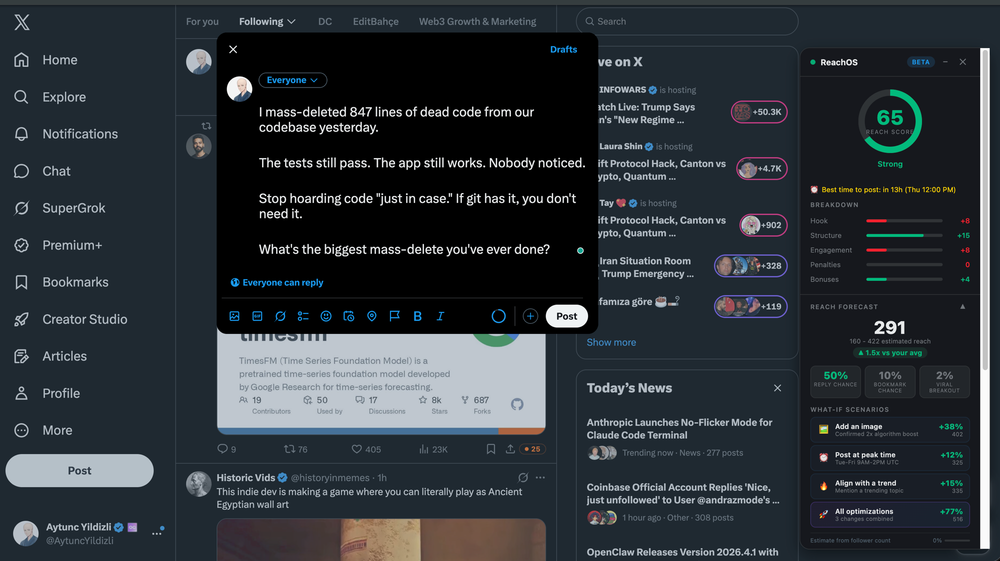

<p align="center">
  <h1 align="center">ReachOS</h1>
  <p align="center">Open-source reach optimizer for X/Twitter. Know your reach before you post.</p>
</p>

<p align="center">
  <a href="#features">Features</a> &bull;
  <a href="#how-it-works">How It Works</a> &bull;
  <a href="#quick-start">Quick Start</a> &bull;
  <a href="#deploy-your-own">Deploy Your Own</a> &bull;
  <a href="#architecture">Architecture</a> &bull;
  <a href="#contributing">Contributing</a>
</p>

---

ReachOS is a Chrome extension that scores your tweets in real time against 36 algorithm-research-backed rules, predicts your reach, and shows you exactly how to improve it. BYOK (Bring Your Own Keys) - fully self-hostable.

```
You type a tweet.
ReachOS says: "This will reach ~14,200 people.
               Remove the link → 21,600.
               Add an image → 19,600.
               Both → 34,400."
```

## Features

### Score Overlay + Reach Forecast
Real-time 0-100 score as you type in the X.com composer. Breakdown bars for Hook, Structure, Engagement, Penalties, and Bonuses. Reach Forecast predicts impressions with interactive what-if scenarios.



### X-Ray Mode
Scores every tweet on your timeline as you scroll. Color-coded pills (red/orange/yellow/green/blue/purple) show reach potential at a glance.


### AI-Powered Analysis (BYOK)
- **AI Slop Detection** - Flags AI-sounding language (28 weighted patterns + Claude verification)
- **Hook Quality Assessment** - 6-dimension analysis of your opening line
- **Auto-Optimize** - 5 rounds of iterative AI rewriting, keeps the best version
- **Self-Reply Generator** - Creates a self-reply to kickstart conversation (150x algorithm boost)

### Smart Signals
- **Trending Alignment** - Detects when your tweet matches trending topics (+5 bonus)
- **Posting Time Optimizer** - Shows whether now is a good time to post based on research-backed UTC windows
- **Reply Coach** - Notifies you about unanswered replies on tracked tweets
- **Account Health** - 5-factor health score with actionable tips

### Self-Learning Loop
The system gets smarter over time:

```
Post tweet → Save prediction → Fetch real metrics (15min)
    → Compare predicted vs actual (daily)
    → Auto-calibrate correction factor
    → Next prediction is more accurate
```

## How It Works

### Scoring Engine (36 Rules)

Every tweet is scored against 36 rules derived from the open-sourced X algorithm and viral pattern research:

| Category | Rules | What It Checks |
|----------|-------|----------------|
| **Hook** | 12 | Opening strength, open loops, contrarian claims, story openers, pattern interrupts, bold claims, list promises |
| **Structure** | 5 | Character length, hashtag/emoji spam, thread length, line breaks |
| **Engagement** | 2 | CTA presence, bookmark-worthy formats |
| **Penalties** | 9 | Engagement bait, text walls, AI slop words/structure, stale formulas, hedging, external links, combative tone, grammar, all-caps |
| **Bonuses** | 7 | First-person voice, media, choice questions, sentiment, readability, contrast/surprise, hashtag placement |

Base score: 30. Category caps prevent any single area from dominating. Final score: 0-100.

### Key Algorithm Signals (Research-Backed)

| Signal | Weight | Source |
|--------|--------|--------|
| Reply | 27x a like | twitter/the-algorithm |
| Author reply to own tweet | 150x a like | twitter/the-algorithm |
| Bookmark | 20x a like | twitter/the-algorithm |
| Media attachment | 2x Earlybird boost | twitter/the-algorithm |
| External link | -30 to -50% reach | Platform testing, Oct 2025 softened |
| 3+ hashtags | ~40% engagement drop | Engagement studies |
| Negative/combative tone | Grok penalty | 2026 sentiment analysis |

### Reach Forecast Model

```
predictedReach = baseReach
                 * contentMultiplier    (score/50 — score 75 = 1.5x)
                 * timeMultiplier       (peak=1.25x, good=1.12x, off=0.85x)
                 * trendMultiplier      (trending=1.15x)
                 * mediaMultiplier      (image/video=1.38x)
                 * linkPenalty          (external link=0.55x)
                 * healthMultiplier     (account health 0.6-1.3x)
                 * calibrationFactor    (auto-corrects from historical data)
```

`baseReach` = average views from your tracked tweets, or `followers * 5%` if no data yet.

## Quick Start

### 1. Clone and install

```bash
git clone https://github.com/AytuncYildizli/reach-optimizer.git
cd reach-optimizer
pnpm install
```

### 2. Set up environment

```bash
cp .env.example apps/api/.env.local
# Edit apps/api/.env.local with your keys
```

**No server required for basic usage.** The extension scores tweets locally with 36 rules. No keys, no database, no setup. Just install and go.

If you want to self-host the API for AI features:

| Key | Where to get it | Required? |
|-----|-----------------|-----------|
| `DATABASE_URL` | [Neon](https://neon.tech) (free tier) or any PostgreSQL | For tracking + dashboard |
| `JWT_SECRET` | `openssl rand -hex 32` | For auth |
| `ANTHROPIC_API_KEY` | [Anthropic Console](https://console.anthropic.com) | For AI analysis (optional) |
| `X_CLIENT_ID` | [X Developer Portal](https://developer.x.com) | For "Connect X" login (optional) |
| `X_CLIENT_SECRET` | X Developer Portal | For "Connect X" login (optional) |
| `TWITTER_API_IO_KEY` | [twitterapi.io](https://twitterapi.io) | For trending + metrics (optional) |
| `CRON_SECRET` | `openssl rand -hex 32` | Protects cron endpoints (recommended) |

### 3. Push database schema

```bash
cd apps/api
npx prisma db push
```

### 4. Run locally

```bash
# From repo root
pnpm dev
```

API runs on `http://localhost:3100`.

### 5. Load the Chrome extension

```bash
pnpm --filter @reach/extension build
```

1. Open `chrome://extensions`
2. Enable "Developer mode"
3. Click "Load unpacked"
4. Select `apps/extension/dist/`
5. Go to X.com and start typing a tweet

### 6. Configure API URL (for local dev)

The extension points to `https://reach-optimizer.vercel.app` by default. For local development, update the API base URL in `apps/extension/src/background/service-worker.ts`:

```typescript
const API_BASE = 'http://localhost:3100';
```

## Deploy Your Own

### One-Click Vercel Deploy

[](https://vercel.com/new/clone?repository-url=https://github.com/AytuncYildizli/reach-optimizer&env=DATABASE_URL,JWT_SECRET,X_CLIENT_ID,X_CLIENT_SECRET&envDescription=Required%20environment%20variables&envLink=https://github.com/AytuncYildizli/reach-optimizer/blob/main/.env.example)

After deploying:

1. Set up a [Neon](https://neon.tech) PostgreSQL database (free tier works)
2. Add your environment variables in Vercel dashboard
3. Run `npx prisma db push` against your production database
4. Update the extension's API URL to your Vercel deployment
5. Build and load the extension

### Cron Jobs

The API includes 4 cron jobs (auto-configured on Vercel):

| Cron | Schedule | What It Does |
|------|----------|-------------|
| `/api/cron/fetch-metrics` | Every 15 min | Fetches real engagement metrics for tracked tweets |
| `/api/cron/auto-optimize-pending` | Daily 03:00 UTC | Batch-optimizes pending tweets from ops DB |
| `/api/cron/learn-weights` | Daily 04:00 UTC | Analyzes which rules predict real engagement |
| `/api/cron/calibrate-forecast` | Daily 05:00 UTC | Compares predicted reach vs actual, auto-corrects |

## Architecture

```
┌─────────────────────────────────────────────────────────────┐
│                    Chrome Extension                         │
│                                                             │
│  ┌──────────────┐  ┌──────────────┐  ┌──────────────────┐  │
│  │  Composer     │  │  Score       │  │  X-Ray Mode      │  │
│  │  Detector     │  │  Overlay     │  │  (timeline)      │  │
│  │  (DOM watch)  │  │  (React)     │  │                  │  │
│  └──────┬───────┘  └──────┬───────┘  └──────────────────┘  │
│         │                 │                                  │
│         ▼                 ▼                                  │
│  ┌──────────────────────────────┐                           │
│  │     Rules Engine (client)    │  36 rules, instant        │
│  │     @reach/rules-engine      │  scoring on every         │
│  └──────────────┬───────────────┘  as you type              │
│                 │                                            │
│                 ▼  (after 2s idle)                           │
│  ┌──────────────────────────────┐                           │
│  │   Service Worker (proxy)     │                           │
│  │   Adds auth header, routes   │                           │
│  │   API calls                  │                           │
│  └──────────────┬───────────────┘                           │
└─────────────────┼───────────────────────────────────────────┘
                  │
                  ▼
┌─────────────────────────────────────────────────────────────┐
│                    Next.js API (Vercel)                      │
│                                                             │
│  ┌────────────┐  ┌────────────┐  ┌──────────────────────┐  │
│  │ /analyze   │  │ /suggest   │  │ /account-health      │  │
│  │ AI delta   │  │ Hook/CTA   │  │ X profile + health   │  │
│  │ only       │  │ rewrites   │  │ score                │  │
│  └─────┬──────┘  └────────────┘  └──────────────────────┘  │
│        │                                                     │
│  ┌─────▼──────────────────────────────────────────────────┐ │
│  │  Claude AI (BYOK)                                      │ │
│  │  - Slop detection (heuristic + LLM)                    │ │
│  │  - Hook quality (6 dimensions)                         │ │
│  │  - Rewrite suggestions (3 variants)                    │ │
│  └────────────────────────────────────────────────────────┘ │
│                                                             │
│  ┌────────────────────────────────────────────────────────┐ │
│  │  PostgreSQL (Neon)                                     │ │
│  │  Users, Analyses, TrackedTweets, TweetMetrics          │ │
│  └────────────────────────────────────────────────────────┘ │
└─────────────────────────────────────────────────────────────┘
```

### Monorepo Structure

```
reach-optimizer/
├── apps/
│   ├── api/                    # Next.js 15 API
│   │   ├── app/api/            # 18 API routes
│   │   ├── app/dashboard/      # Web dashboard
│   │   ├── lib/                # Auth, DB, trending, scoring
│   │   └── prisma/schema.prisma
│   └── extension/              # Chrome Extension (Manifest V3)
│       ├── src/content/        # Score overlay, X-Ray, forecast engine
│       ├── src/popup/          # Extension popup (auth, settings)
│       └── src/background/     # Service worker (API proxy)
├── packages/
│   ├── rules-engine/           # 35 scoring rules + ScoreEngine
│   │   ├── src/rules/          # 9 rule files
│   │   ├── src/config/         # weights.json (v3.0)
│   │   └── src/__tests__/      # 119 tests
│   ├── ai-checks/              # AI analysis (Claude integration)
│   │   ├── src/analyzer.ts     # Slop + hook + suggestions
│   │   ├── src/slop-detector.ts # 28 heuristic patterns
│   │   └── src/__tests__/      # 13 tests
│   └── shared-types/           # TypeScript types for all packages
├── docs/
│   └── prd-self-learning-reach-engine.md
├── .env.example
├── vercel.json                 # Cron jobs + deploy config
└── turbo.json                  # Turborepo config
```

## API Reference

### Core

| Endpoint | Method | Auth | Description |
|----------|--------|------|-------------|
| `/api/analyze` | POST | Optional | AI analysis delta (slop, hook, trending) |
| `/api/suggest` | POST | JWT | Hook rewrites or self-reply generation |
| `/api/tweets/auto-optimize` | POST | JWT | 5-round iterative AI rewriting |
| `/api/tweets/reply-suggestions` | POST | JWT | Reply templates for engagement |
| `/api/tweets/suggestions` | GET | JWT | Personalized tweet ideas |

### Tracking & Intelligence

| Endpoint | Method | Auth | Description |
|----------|--------|------|-------------|
| `/api/tweets/track` | POST | Optional | Save posted tweet + predicted reach |
| `/api/tweets/metrics` | GET | JWT | Real engagement metrics for tracked tweets |
| `/api/account-health` | GET | JWT | 5-factor account health + reach multiplier |
| `/api/timing` | GET/POST | No | Optimal posting time windows by timezone |
| `/api/trending` | GET | No | Currently trending topics on X |
| `/api/weights` | GET | Optional | Personalized weight adjustments |
| `/api/calibration/report` | GET | JWT | Score vs outcome correlation report |

### Auth

| Endpoint | Method | Description |
|----------|--------|-------------|
| `/api/auth/login` | GET | Initiates X OAuth 2.0 PKCE flow |
| `/api/auth/callback` | GET/POST | Exchanges code for JWT |

## Running Tests

```bash
# All tests (132 passing)
pnpm test

# Just rules engine (119 tests)
pnpm --filter @reach/rules-engine test

# Type checking
pnpm typecheck
```

## Tech Stack

| Layer | Technology |
|-------|-----------|
| Extension | React 19, Vite, Manifest V3, Shadow DOM |
| API | Next.js 15, Vercel Serverless |
| Database | Prisma 6, PostgreSQL (Neon) |
| AI | Anthropic Claude (Haiku 4.5 for speed, Sonnet 4.6 for ideas) |
| Monorepo | Turborepo, pnpm |
| Language | TypeScript (strict) |

## Contributing

See [CONTRIBUTING.md](CONTRIBUTING.md) for how to add rules, fix bugs, and submit PRs.

## Further Reading

- [I Read X's Open-Source Algorithm — Here's What Actually Matters in 2026](https://hackernoon.com/i-read-xs-open-source-algorithm-heres-what-actually-matters-in-2026) - Deep dive on the same algorithm signals ReachOS scores against
- [twitter/the-algorithm](https://github.com/twitter/the-algorithm) - X's open-sourced recommendation algorithm (primary source for our rules)

## License

MIT - see [LICENSE](LICENSE).